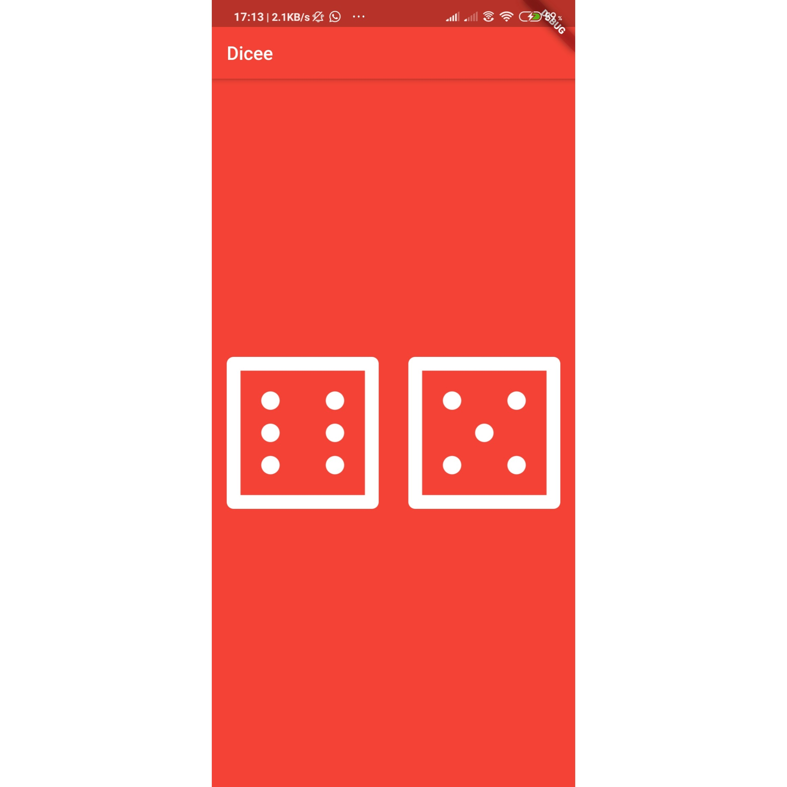
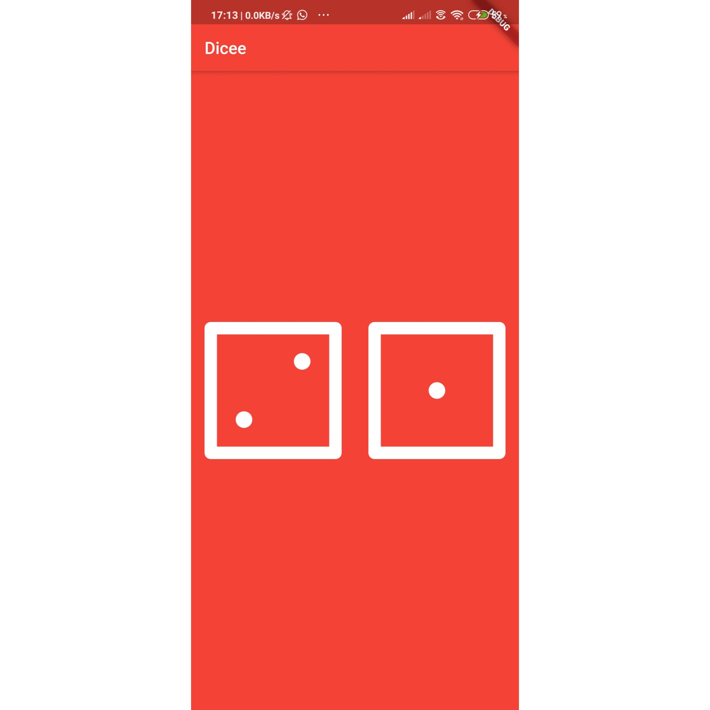

# My_Dice

A simple Flutter application. You can make the Dice roll at the press of a button. With this app in your pocket, you'll be able to settle any score on the go!

Now you can click on any one of the Dice and both faces get changed as follows:

So basically this app is a simple Dice app which you can use when you dont have a physical dice.

- [Lab: Write your first Flutter app](https://flutter.dev/docs/get-started/codelab)
- [Cookbook: Useful Flutter samples](https://flutter.dev/docs/cookbook)

For help getting started with Flutter, view our
[online documentation](https://flutter.dev/docs), which offers tutorials,
samples, guidance on mobile development, and a full API reference.
